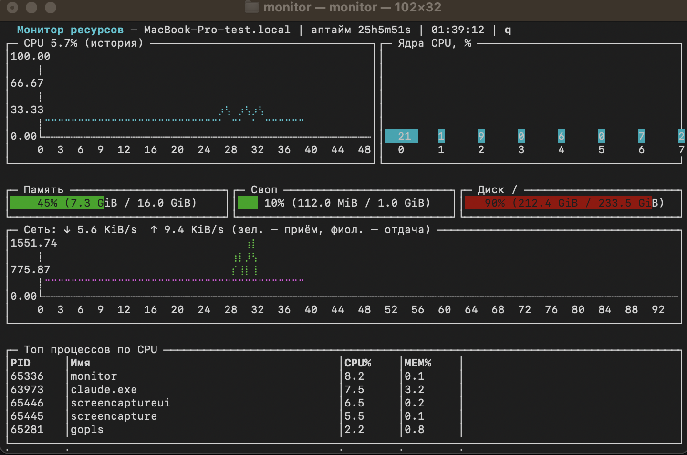

# monitor

Монитор ресурсов компьютера в терминале на Go (termui + gopsutil).



Показывает: график CPU, загрузку ядер, память, своп, диск, сеть и топ процессов.

## Сборка

```bash
go build -o monitor .
```

## Запуск

```bash
./monitor
```

Выход — `q` или `Ctrl+C`.
